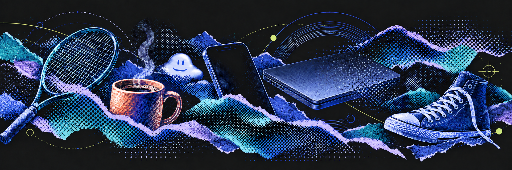

## Hi, I'm Grant.

I build AI agents at [Limelight](https://www.limelighthq.com/), run Groundwork AI, and make apps and tools I want to use. I write about what I'm building and learning along the way.

### Selected projects

- **[Hermes iOS](https://github.com/glisom/hermes-ios)** — An iPhone app for chatting with Hermes Agent and managing its sessions, jobs, and skills.
- **[Vampire](https://github.com/glisom/vampire)** — A macOS menu bar app that keeps your MacBook awake with the lid closed and restores normal sleep when you're done.

### Recent writing

- [Vampire: Keep Your MacBook Awake](https://grantisom.com/2026/09/01/vampire.html)
- [skill-thief: Steal the Ideas, Not the Install](https://grantisom.com/2026/09/01/skill-thief.html)

[More writing →](https://grantisom.com/blog/)

---

Based in Kansas City. Dad, tennis player, and opinionated about coffee.

[Website](https://grantisom.com) · [LinkedIn](https://linkedin.com/in/grantisom) · [Email](mailto:grant.isom@gmail.com)
